## Start Gym_With_Me Android App
### The fitness app is tailored for individuals who are dealing with excess weight. It serves as a handy tool for them to determine their BMI, establish personal goals, and design a workout regimen based on their preferences. Additionally, the app provides a profile section where users can monitor their advancement.

##  1. Users need to create an account to access all the features the app offers.

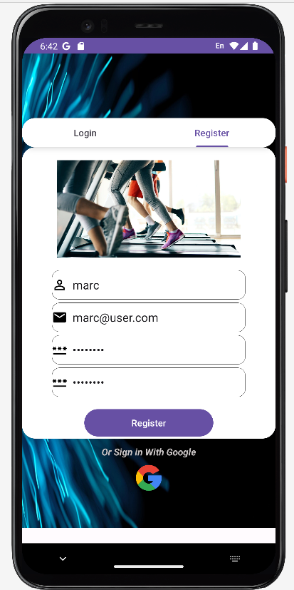

##  2. A user attempts to register using an invalid email address.

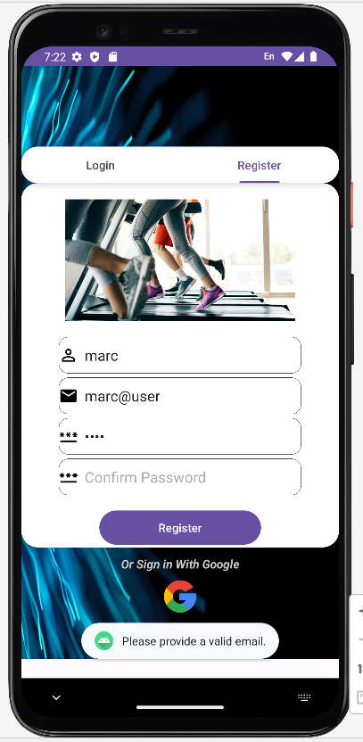

##  3. User Register: Passwords don't match

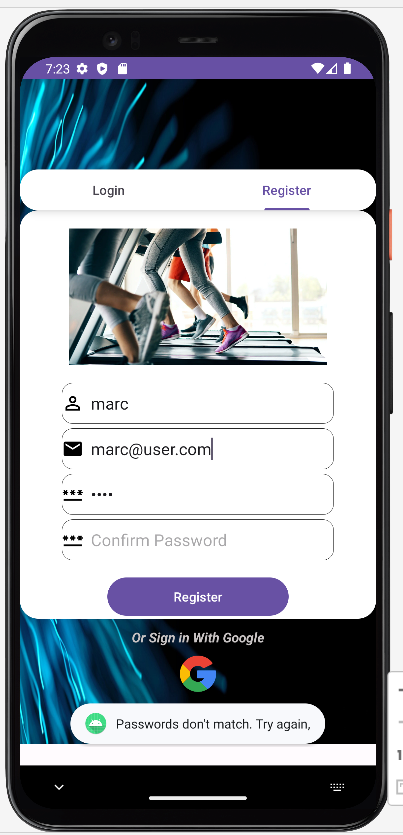

##  4. User Register Successfully

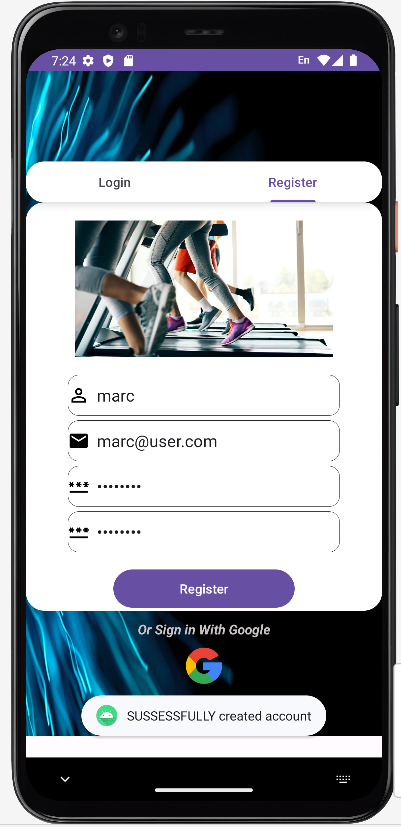

## 5. User Login with error 

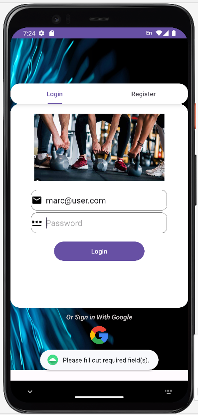

## 6. After a successful login, the user is redirected to the Home page.
- At this stage, users are asked to input their personal data, such as age, weight, and height. Providing accurate details ensures optimal results.

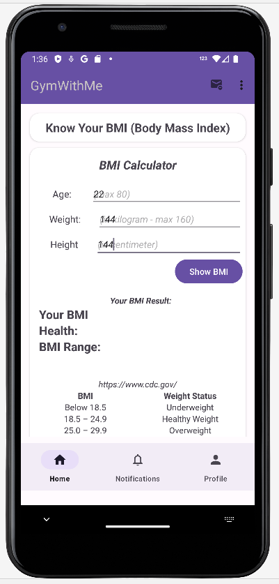

## 7. The app then generates the result of your BMI.
- Following that, users can evaluate their BMI against the scale displayed directly underneath.

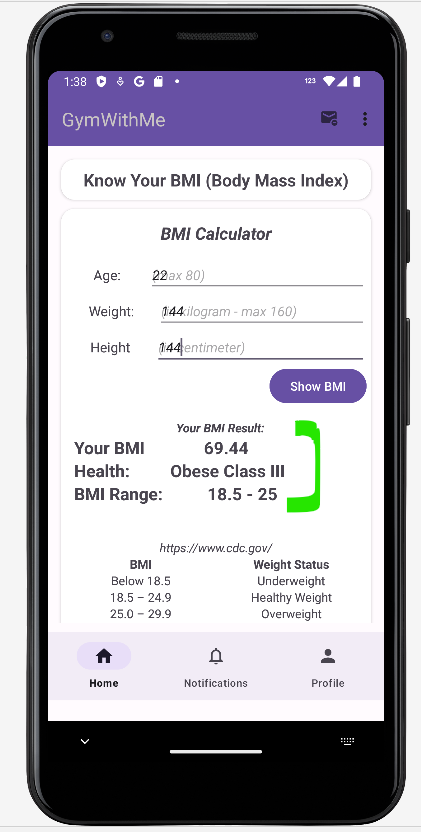

## 8. From this point, users are navigated to the Set a Goal page. Directly below, a recyclerView is displayed, populated from an API, allowing users to make a selection.

Depending on the user's preferences, the API calculates and displays the total calories they would burn for the specific duration they input in the search box above.
Users have the freedom to choose any activity. However, if they decide to change their activity later, their journey will reset. This design choice encourages users to remain committed to their selected goal until it's realized. Both strategies are geared toward promoting consistent effort.
If, for any reason, users wish to retain their current streakCounter, the administrative team is available to assist.

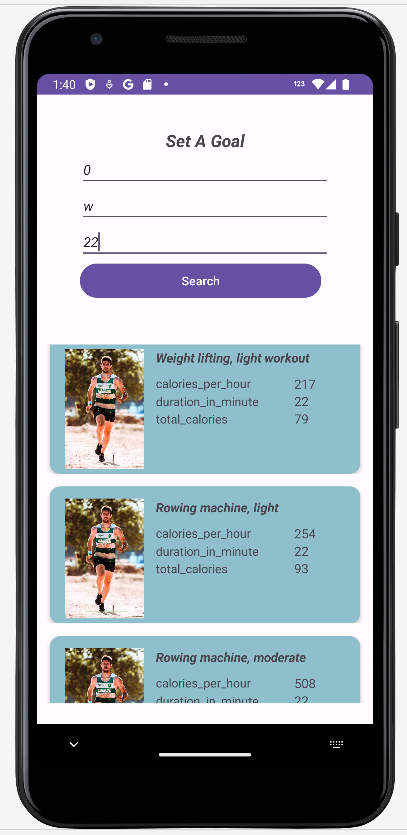

## 9. Depending on the goal they select, information regarding their present health status will be presented.

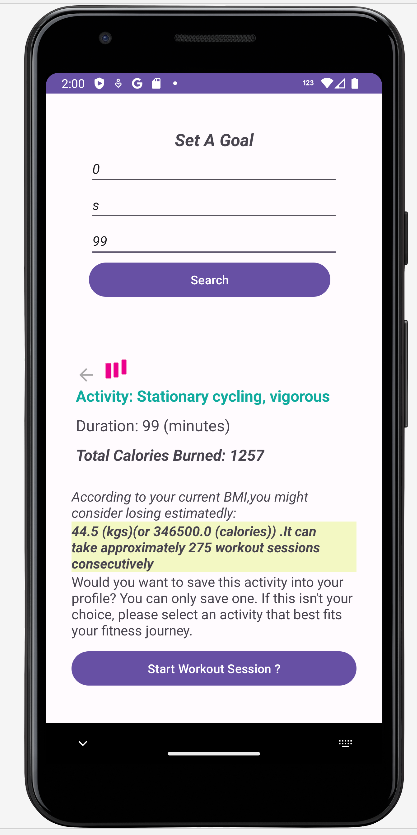

## 10. If the user is satisfied with the chosen goal and its outcome, they will commence with the initial trial session.

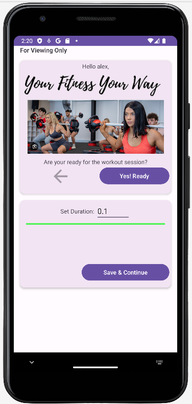

## 11. The field `No. Sessions so far` is 0 indicates that this first session is not counted

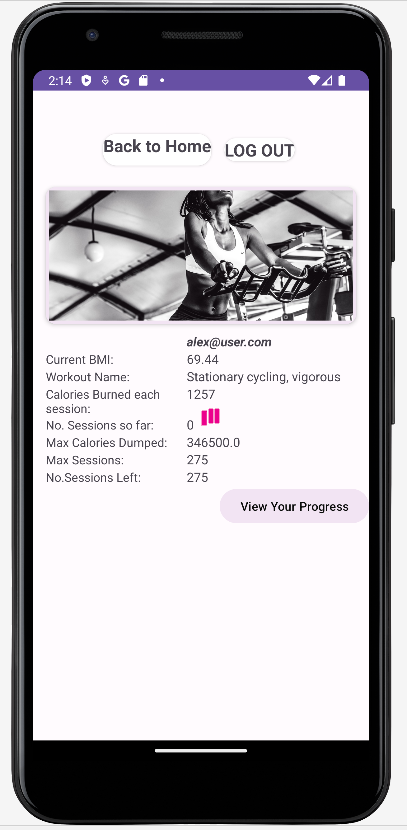

 

## 12. Upon completing the first trial, users will have a clearer understanding of whether the activity suits them. They have the option to switch to a different goal if they wish. If they decide to continue with their current choice, the app will prompt them to subscribe and process the payment using Stripe.

Users must complete all mandatory fields.
For educational purposes, only one specific account will be accepted, which is provided by [Stripe](https://stripe.com/docs/payments/accept-a-payment)

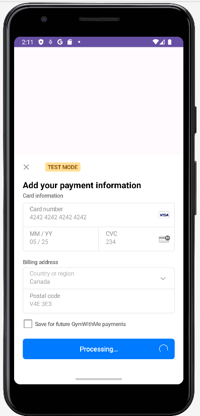

## 13. Users will be prompted to enter the provided 16-digit account number. SUCCESS!

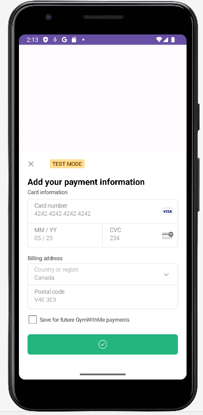

## 14.User then can view their receipt at `Notifications` box

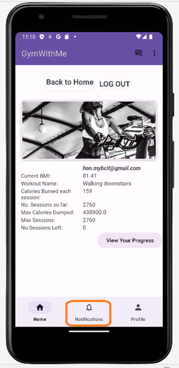

## 15.Once the user's bank account is activated, the app allows them to participate in the actual workout session.

On the Home page, a new button powered by Stripe appears. Users can access this feature directly without any additional prerequisites.

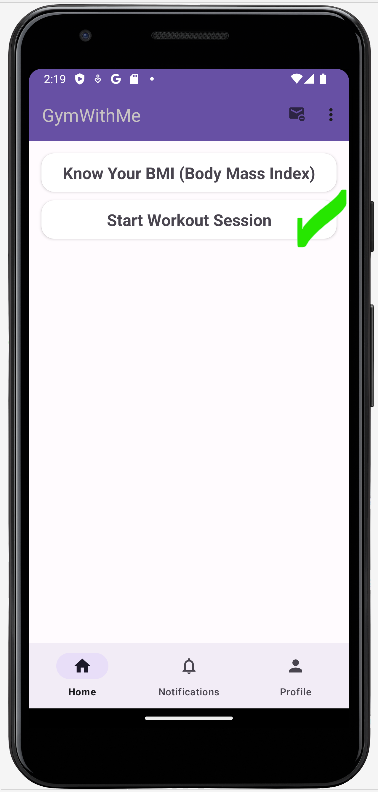

## 16.From this point, users actively engage in the workout session.

Given the individual health conditions of the user, they can input any duration in minutes as they see fit.
The app also supports the entry of floating-point values.

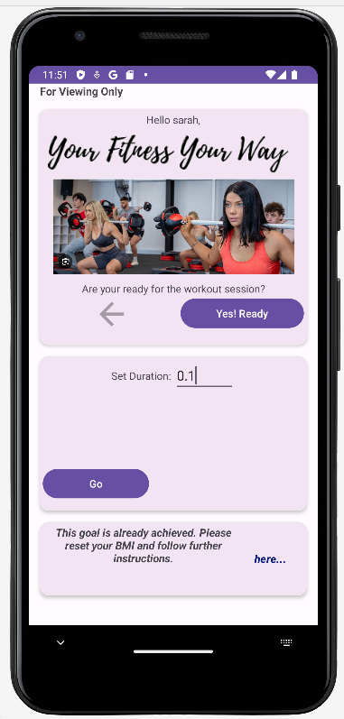

## 17.Successful workout session

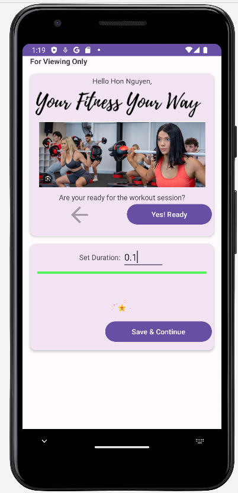

## 18.After this workout, their `streakCounter` will be added up.
- Check profile for viewing this update

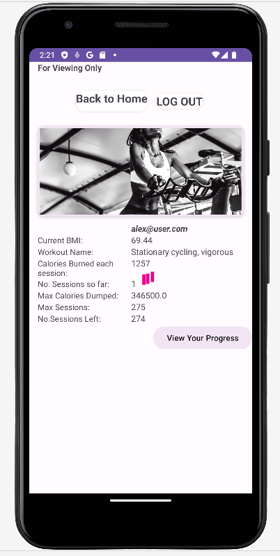

## 19 Throughout their journey, users can monitor their progress by selecting the `View Your Progress` button.

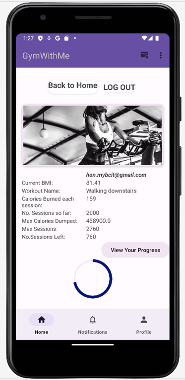

## 20. Here's an example of a top-tier user. They receive hearty congratulations!

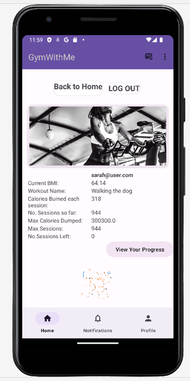

## 21. GOOGLE SIGN-IN: For users with an existing Gmail account, the "Sign-in with Google" option offers a convenient alternative. Just tap on the Google icon and follow the on-screen prompts to proceed.

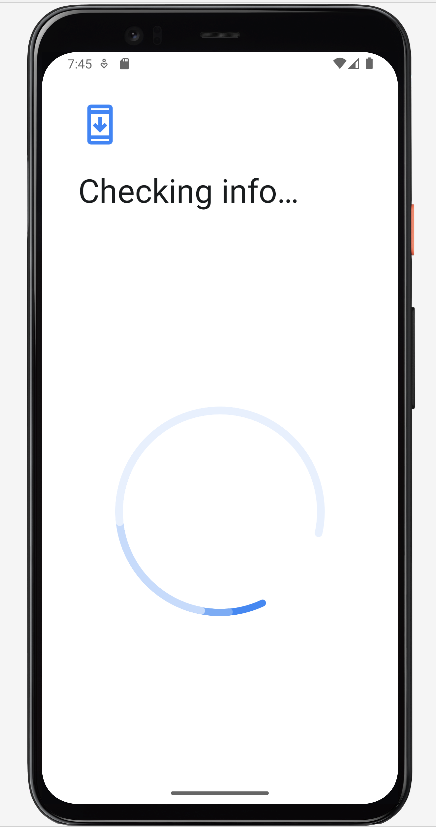

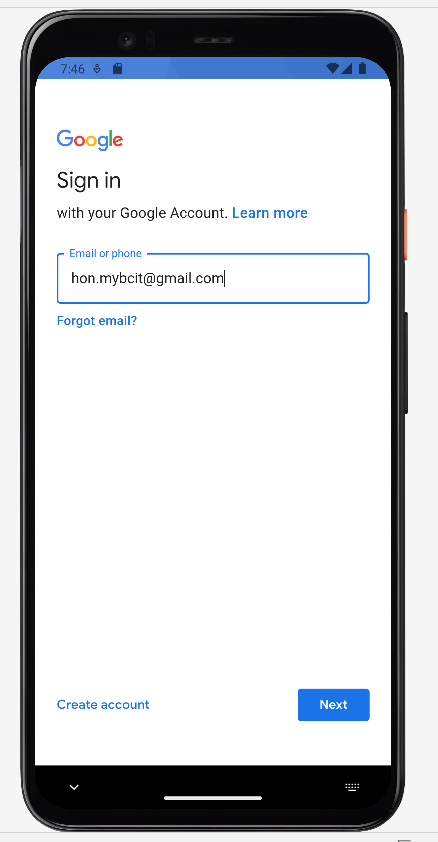

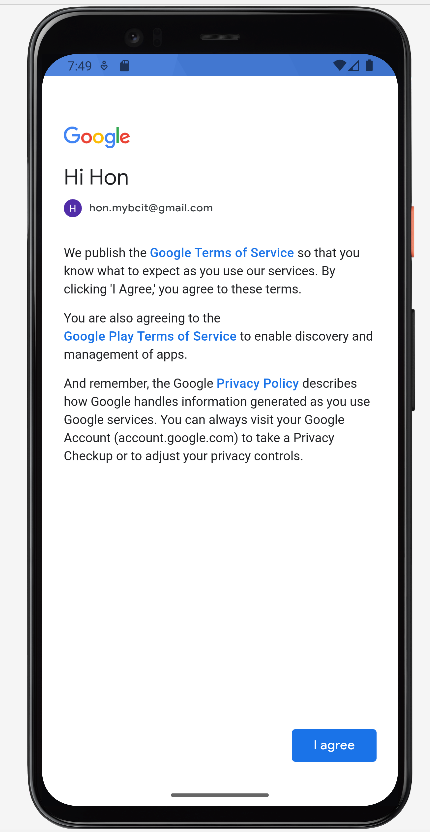

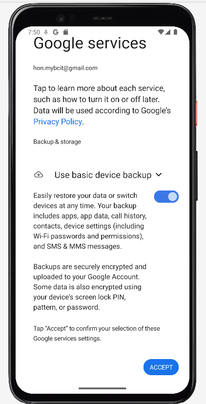

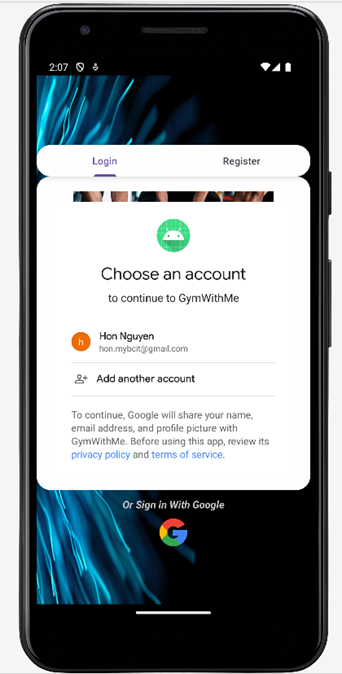

# Admin Route
## 22. Admin has full CRUD (Create, Read, Update, Delete) capabilities.

Specifically, in this project, the admin has the authority to delete users who have asked to be removed from the system.
In the example provided, the admin will proceed to remove the user named Ella.

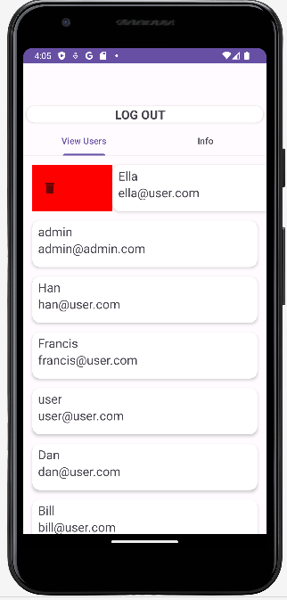

## 23. The app will make a confirmation if this user wanted to be removed? If yes, do it.

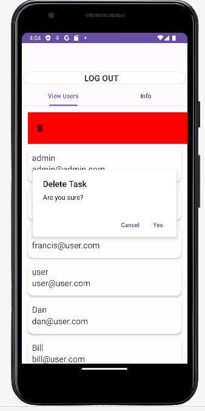

## 24. However, if the admin attempts to delete their own account.

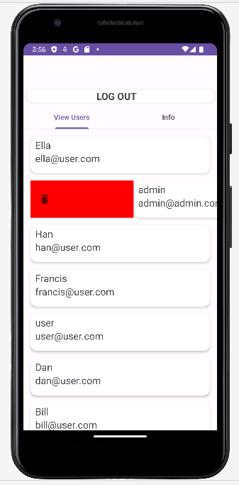

## 25. Oops! That action is prohibited. The `system admin` will prevent such an operation.

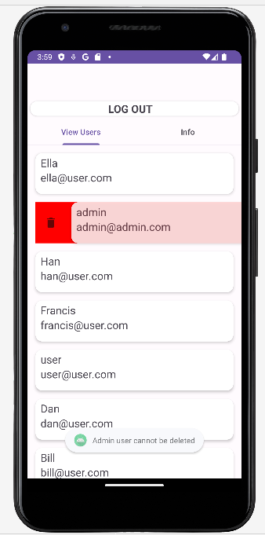

## 26. As previously noted, the user Ella was deleted from the system. Now, if the admin attempts to create a new user using the same email address that belonged to Ella, this will be disallowed. Google Firebase authentication will block such an action, and the admin will probably receive an alert or warning message.

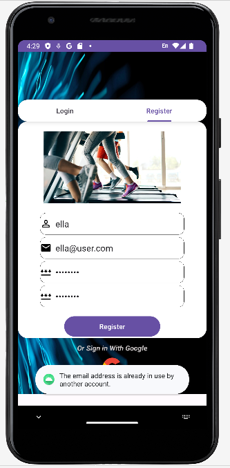

